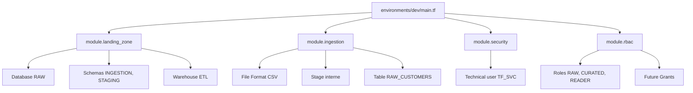
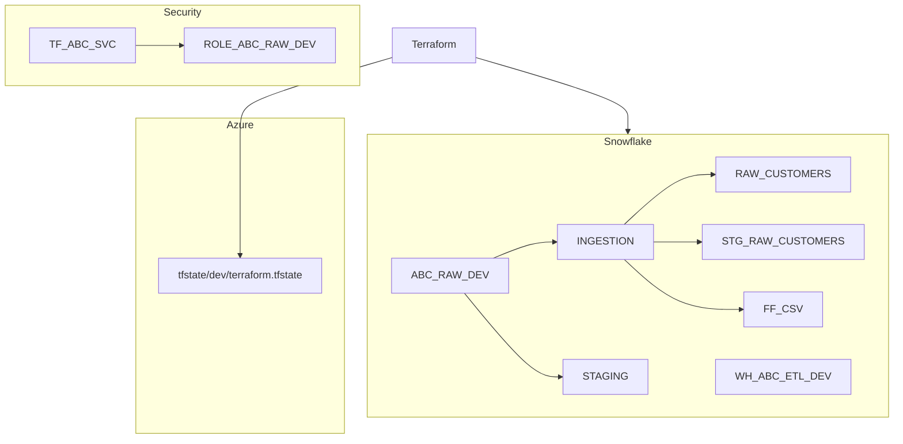

# 🧪 Lab M12 — Capstone : Plateforme de données complète

> [<- Jour 4](../README.md) · [<- Module precedent](../module-11-rbac/lab.md) · **Module 12** · [Module suivant ->](../module-13-finops-observability/lab.md)

| Élément | Valeur |
|---|---|
| **Durée** | 120 min |
| **Piste** | `[CORE]` |
| **Workspace** | `$HOME/Data2AI-Labs/data-platform` (le clone) |
| **Dossier de travail** | `environments/dev/` |
| **Coût** | Warehouses X-SMALL |
| **Cleanup** | Détruire à la fin |

## 🎯 Mission

Le comité d'architecture attend une plateforme gouvernée, exploitable et auditable. Vous allez assembler tous les modules créés (landing-zone, ingestion, security, RBAC) dans une configuration complète et prouver le zero-drift.

## 🏗️ Architecture



## 🎯 Objectifs

- composer tous les modules dans une configuration unique;
- déployer la plateforme complète en une seule commande;
- prouver le zero-drift avec `terraform plan -detailed-exitcode`;
- documenter l'architecture avec les outputs.

## 📋 Prérequis

- [ ] M5 à M11 terminés : tous les modules existent;
- [ ] `terraform plan` affiche `No changes` dans `environments/dev/`.

## 📝 Partie 1 — Composez la configuration finale

### 📝 Étape 1.1 — Vérifier `environments/dev/main.tf`

Ouvrez `environments/dev/main.tf` et vérifiez qu'il contient les 4 modules :

```hcl
module "landing_zone" {
  source              = "../../modules/landing-zone"
  learner_prefix      = var.learner_prefix
  environment         = var.environment
  warehouse_size      = var.warehouse_size
  data_retention_days = var.data_retention_days
  auto_suspend_seconds = var.auto_suspend_seconds

  schemas = {
    ingestion = { name = "INGESTION", comment = "Ingestion schema" }
    staging   = { name = "STAGING",   comment = "Staging schema" }
  }

  warehouses = {
    etl = { size = "X-SMALL", auto_suspend = 60, comment = "ETL warehouse" }
  }
}

module "ingestion" {
  source     = "../../modules/ingestion"
  database   = module.landing_zone.database_name
  schema     = "INGESTION"
  table_name = "RAW_CUSTOMERS"
  stage_name = "STG_RAW_CUSTOMERS"
}

module "security" {
  source            = "../../modules/security"
  user_name         = "TF_${var.learner_prefix}_SVC"
  default_role      = "SYSADMIN"
  default_warehouse = module.landing_zone.warehouse_names.etl
  rsa_public_key    = var.rsa_public_key
}

module "rbac" {
  source        = "../../modules/rbac"
  learner_prefix = var.learner_prefix
  environment   = var.environment
  database_name = module.landing_zone.database_name
  schema_name   = "INGESTION"
}

resource "snowflake_grant_account_role" "tech_raw" {
  role_name  = module.rbac.role_raw
  user_name  = module.security.user_name
}
```

### 📝 Étape 1.2 — Vérifier les outputs

`environments/dev/outputs.tf` doit exposer :

```hcl
output "database_name" {
  value = module.landing_zone.database_name
}

output "warehouse_names" {
  value = module.landing_zone.warehouse_names
}

output "ingestion_table" {
  value = module.ingestion.table_name
}

output "technical_user" {
  value = module.security.user_name
}

output "rbac_roles" {
  value = {
    raw     = module.rbac.role_raw
    curated = module.rbac.role_curated
    reader  = module.rbac.role_reader
  }
}

output "platform_summary" {
  value = {
    database   = module.landing_zone.database_name
    schemas    = module.landing_zone.schema_names
    warehouses = module.landing_zone.warehouse_names
    user       = module.security.user_name
    roles      = module.rbac.role_raw
  }
}
```

### 📝 Étape 1.3 — Formater et valider

```bash
cd environments/dev
terraform fmt
terraform validate
```

✅ **Checkpoint** : `The configuration is valid.`

## 📝 Partie 2 — Déployer la plateforme

### 📝 Étape 2.1 — Planifier

<details>
<summary>🪟 <b>Windows (PowerShell)</b></summary>

```powershell
terraform plan -out "capstone.tfplan"
```
</details>

<details>
<summary>🐧 <b>Linux/macOS (Bash)</b></summary>

```bash
terraform plan -out=capstone.tfplan
```
</details>

✅ **Checkpoint** : `No changes.` si tous les modules sont déjà déployés.

Si des changements apparaissent, relisez le plan avant d'appliquer.

### 📝 Étape 2.2 — Appliquer

```bash
terraform apply capstone.tfplan
```

### 📝 Étape 2.3 — Vérifier les outputs

```bash
terraform output platform_summary
```

✅ **Checkpoint** : un objet avec la database, les schemas, les warehouses, l'utilisateur et les rôles.

## 📝 Partie 3 — Prouver le zero-drift

### 📝 Étape 3.1 — Plan avec detailed-exitcode

```bash
terraform plan -detailed-exitcode
```

| Code | Signification |
|---|---|
| 0 | No changes — zero drift |
| 1 | Error |
| 2 | Changes detected — drift |

✅ **Checkpoint** : code 0 (no changes).

### 📝 Étape 3.2 — Simuler une dérive

Modifiez une ressource hors Terraform :

```bash
snow sql -c training -q "ALTER DATABASE ABC_RAW_DEV SET COMMENT = 'Drift test'"
```

### 📝 Étape 3.3 — Détecter la dérive

```bash
terraform plan -detailed-exitcode
```

✅ **Checkpoint** : code 2 (changes detected).

### 📝 Étape 3.4 — Corriger la dérive

```bash
terraform apply
```

### 📝 Étape 3.5 — Vérifier le retour à zero-drift

```bash
terraform plan -detailed-exitcode
```

✅ **Checkpoint** : code 0.

## 📝 Partie 4 — Documenter l'architecture

### 📝 Étape 4.1 — Générer un diagramme

Dans `docs/architecture.md`, ajoutez un diagramme Mermaid qui reflète votre déploiement réel :



### 📝 Étape 4.2 — Capturer les outputs

```bash
terraform output -json > docs/dev-outputs.json
```

> 🔒 **SECURITY** Vérifiez qu'aucun secret n'apparaît dans le JSON avant de commiter.

## 🏆 Challenge

Ajoutez un module `monitoring` qui crée une database `ABC_MONITORING_DEV` avec un schema `METRICS` et une table `WAREHOUSE_USAGE`. Configurez un Future Grant pour que le rôle `ROLE_ABC_RDR_DEV` puisse lire cette table.

Critères :

- [ ] `terraform plan` crée les ressources monitoring;
- [ ] `terraform apply` réussit;
- [ ] `terraform plan -detailed-exitcode` retourne 0;
- [ ] le Future Grant est visible avec `SHOW FUTURE GRANTS`.

## 🧹 Cleanup

À la fin de la formation, détruisez toutes les ressources :

```bash
cd environments/dev
terraform destroy
cd ../uat
terraform destroy
cd ../prod
terraform destroy
```

Et supprimez le backend Azure :

```bash
az storage account delete --name "$ARM_STORAGE_ACCOUNT" --resource-group "$ARM_RESOURCE_GROUP" --yes
az group delete --name "$ARM_RESOURCE_GROUP" --yes
```
