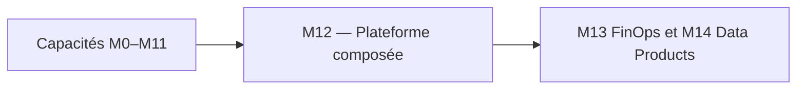
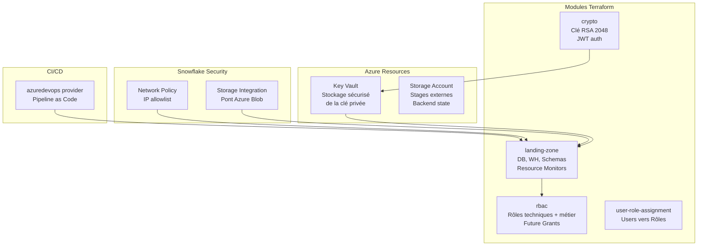
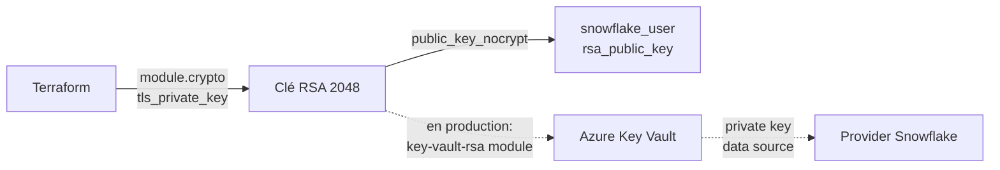
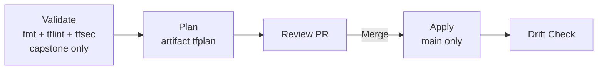
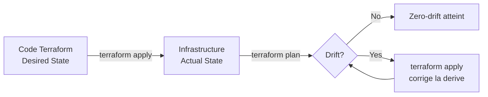

# Lab M12 -- Capstone : Plateforme de données complète

**Durée :** 120 min
**Code :** `project/05-capstone/environments/dev/`
**Patterns :** Module composition, landing-zone + rbac + crypto + KeyVault, Azure stages, file formats, network policy, FinOps, azuredevops provider, zero-drift, documentation as code

---

## Contexte métier

Le comité d'architecture attend une plateforme gouvernée, exploitable et auditable plutôt qu'une collection de ressources. Le capstone assemble les capacités précédentes et démontre le zero-drift.

## Contexte architecture



| Référentiel | Alignement |
|---|---|
| Pattern | Composed Enterprise Platform |
| Azure Well-Architected | Les cinq piliers |
| Azure CAF | Manage |
| Platform Engineering | Produit plateforme intégré et exploitable |

## Pattern d'entreprise

Le pattern **Composed Enterprise Platform** assemble des modules à contrat stable, des providers à rôles séparés, une CI/CD gouvernée et une validation zero-drift.

## Objectifs

À l'issue de ce lab, vous serez capable de :

- ✅ Composer 3 modules Terraform (`landing-zone` + `rbac` + `crypto`) plus une ressource `snowflake_user` dans un seul root module.
- ✅ Configurer 4 providers Snowflake avec aliases (`sysadmin`, `useradmin`, `securityadmin`) + `azurerm` avec `deployment_mode`.
- ✅ Chaîner les outputs entre modules (`module.landing_zone.warehouse_names["etl"]` → `module.rbac`).
- ✅ Créer un `snowflake_user` avec clé RSA générée par le module `crypto` (`rsa_public_key = module.crypto.public_key_nocrypt`).
- ✅ Déployer des `snowflake_file_format` et `snowflake_network_policy` au niveau root.
- ✅ Comprendre que `source` est statique : chemin local dans le monorepo ou URL Git avec `?ref=` dans une variante de root.
- ✅ Vérifier le zero-drift : `terraform plan` = `No changes` après déploiement.
- ✅ Déployer DEV et TEST en parallèle avec isolation par backend key.

---

## Prérequis

> **Prérequis communs :** le Lab M0 est terminé et `terraform plan` fonctionne dans `project/01-day1-basics`. En mode formation, utilisez uniquement le secret `SNOWFLAKE_PASSWORD` distribué par le formateur ; ne stockez jamais sa valeur dans Git.

- **Tous les labs M1 à M11 terminés**
- Terraform >= 1.14.5
- Providers : Snowflake ~> 2.14.0, azurerm ~> 4.59.0, azuredevops 1.14.0, TLS >= 4.0
- Backend Azure Blob Storage configuré (Lab M2)
- Modules `landing-zone`, `rbac`, `crypto`, `user-role-assignment` disponibles dans `project/03-day2-modules/modules/`
- Azure CLI connecté (`az login`)
- (Optionnel) Azure DevOps project pour le provider `azuredevops`

---

## Concept — Pourquoi avant comment

Le capstone intègre **tous les patterns** des labs précédents en une seule plateforme : landing-zone (databases + warehouses + schemas + resource monitors), RBAC (rôles techniques + métier + future grants), crypto (génération de clés RSA), Azure Key Vault (stockage sécurisé des secrets), stages/file formats (ingestion), network policy (sécurité réseau), et pipeline CI/CD via le provider `azuredevops`. L'objectif est le **zero-drift** : `terraform plan` = `No changes` après déploiement.



**Patterns IaC :**
- **Module Composition :** Le capstone compose 4 modules (landing-zone + rbac + crypto + user-role-assignment)
- **Zero-Drift :** Après `apply`, `plan` doit afficher `No changes`
- **Documentation as Code :** README généré depuis le code, architecture diagram en Mermaid
- **FinOps :** Resource monitors avec alertes 75/90/100/110% sur tous les warehouses
- **Security :** Key Vault pour la clé privée, network policy pour l'accès réseau
- **CI/CD as Code :** Le provider `azuredevops` gère le pipeline Azure DevOps dans Terraform

---

## Implémentation guidée

### Étape 1 -- Analyser la structure du capstone (15 min)

**Objectif :** Comprendre l'architecture complète du projet.

```powershell
cd project/05-capstone/environments/dev
ls
```

**Structure attendue :**
```
project/05-capstone/
  modules/                    # Modules partagés (liens vers 03-day2-modules)
  environments/
    dev/
      main.tf                 # Composition des modules
      provider.tf             # Providers Snowflake + azurerm + azuredevops
      versions.tf             # Version constraints
      variables.tf            # Variables du root module
      outputs.tf              # Outputs du root module
      backend.tf              # Backend Azure Blob
      terraform.tfvars        # Paramètres DEV
    test/
      ...                     # Structure identique, paramètres TEST
```

Lire `main.tf` et identifier les modules composés :

```hcl
# Crypto module to generate RSA keys (training/sandbox only)
module "crypto" {
  source = "../../../03-day2-modules/modules/crypto"
}

# Landing Zone (databases, warehouses, monitors, tags)
module "landing_zone" {
  source = "../../../03-day2-modules/modules/landing-zone"

  environment  = var.environment
  project      = var.project
  schemas      = var.schemas
  credit_quota = var.credit_quota

  warehouses = {
    etl = {
      size         = "X-SMALL"
      auto_suspend = 60
      max_clusters = 2
    }
    analytics = {
      size         = "SMALL"
      auto_suspend = 120
    }
  }
}

# RBAC configuration (Technical & Business roles)
module "rbac" {
  source = "../../../03-day2-modules/modules/rbac"

  environment           = var.environment
  raw_database_name     = module.landing_zone.raw_database_name
  curated_database_name = module.landing_zone.curated_database_name
  etl_warehouse_name    = module.landing_zone.warehouse_names["etl"]
}

# Snowflake User authenticated via generated RSA Key
resource "snowflake_user" "svc_user" {
  name              = "SVC_${var.environment}_USER"
  login_name        = "SVC_${var.environment}_USER"
  default_warehouse = module.landing_zone.warehouse_names["etl"]
  default_role      = "RL_DATA_ENGINEER_${var.environment}"
  rsa_public_key    = module.crypto.public_key_nocrypt
}
```

> **Pattern :** Le capstone **compose** 3 modules (`crypto` + `landing_zone` + `rbac`) plus une ressource `snowflake_user` et des ressources root (`snowflake_file_format`, `snowflake_network_policy`). Les outputs d'un module (ex: `module.landing_zone.warehouse_names["etl"]`) deviennent les inputs d'un autre (ex: `module.rbac.etl_warehouse_name`). Le pattern `module_source` permet de basculer entre chemins locaux (`"local"`) et Git URL avec tag immutable (`module_version`) pour la production. C'est la **composition de modules**.

**Questions de compréhension :**
1. Combien de modules sont composés ? Quels sont leurs noms ?
2. Comment le module `rbac` reçoit-il le nom du warehouse ETL ? (Via `module.landing_zone.warehouse_names["etl"]`)
3. Pourquoi `source` ne peut-il pas utiliser une variable ? (Terraform doit résoudre les modules pendant `init`)

---

### Étape 2 -- Configurer les providers multiples (10 min)

**Objectif :** Comprendre la configuration multi-providers du capstone.

Lire `provider.tf` :

```hcl
# Provider Snowflake (principal)
provider "snowflake" {
  organization_name = var.snowflake_organization
  account_name      = var.snowflake_account
  user              = var.snowflake_user
  role              = var.snowflake_role

  # Training mode: password fallback
  password      = var.deployment_mode == "training" ? var.snowflake_password : null
  authenticator = var.deployment_mode == "training" ? "snowflake" : null

  # Production mode: JWT key-pair auth
  private_key_path = var.deployment_mode == "production" ? var.private_key_path : null

  preview_features_enabled = ["snowflake_file_format_resource", "snowflake_stage_internal_resource", "snowflake_stage_external_azure_resource"]
}

# Provider alias: SYSADMIN for database/warehouse/schema operations
provider "snowflake" {
  alias             = "sysadmin"
  organization_name = var.snowflake_organization
  account_name      = var.snowflake_account
  user              = var.snowflake_user
  role              = "SYSADMIN"

  password          = var.deployment_mode == "training" ? var.snowflake_password : null
  authenticator     = var.deployment_mode == "training" ? "snowflake" : null
  private_key_path  = var.deployment_mode == "production" ? var.private_key_path : null

  preview_features_enabled = ["snowflake_file_format_resource", "snowflake_stage_internal_resource", "snowflake_stage_external_azure_resource"]
}

# Provider alias: USERADMIN for user and role management
provider "snowflake" {
  alias             = "useradmin"
  organization_name = var.snowflake_organization
  account_name      = var.snowflake_account
  user              = var.snowflake_user
  role              = "USERADMIN"

  password          = var.deployment_mode == "training" ? var.snowflake_password : null
  authenticator     = var.deployment_mode == "training" ? "snowflake" : null
  private_key_path  = var.deployment_mode == "production" ? var.private_key_path : null
}

# Provider alias: SECURITYADMIN for RBAC and security operations
provider "snowflake" {
  alias             = "securityadmin"
  organization_name = var.snowflake_organization
  account_name      = var.snowflake_account
  user              = var.snowflake_user
  role              = "SECURITYADMIN"

  password          = var.deployment_mode == "training" ? var.snowflake_password : null
  authenticator     = var.deployment_mode == "training" ? "snowflake" : null
  private_key_path  = var.deployment_mode == "production" ? var.private_key_path : null
}

# Provider AzureRM (Key Vault, Storage Account)
provider "azurerm" {
  features {}
}
```

> **Pattern :** Le capstone utilise **4 blocs provider Snowflake** (principal + 3 aliases `sysadmin`, `useradmin`, `securityadmin`) plus `azurerm`. Chaque alias s'authentifie avec un role différent pour respecter la **séparation des pouvoirs**. Le pattern `deployment_mode` conditionne l'authentification : `training` (password) ou `production` (JWT key-pair). Le provider `azuredevops` est déclaré dans `versions.tf` mais non configuré dans `provider.tf` — il nécessite un PAT injecté via CI/CD.

---

### Étape 3 -- Déployer la landing zone (15 min)

**Objectif :** Déployer les databases, warehouses, schemas et resource monitors.

Créer `terraform.tfvars` (copier depuis `terraform.tfvars.example`) :

```hcl
# Copy to terraform.tfvars and set <SNOWFLAKE_PASSWORD> from the secure value supplied outside Git
# Training mode uses password fallback. For production, set deployment_mode = "production"
# and provide private_key_path instead of password.

deployment_mode        = "training"
snowflake_organization = "<snowflake-organization>"
snowflake_account      = "<snowflake-account>"
snowflake_user         = "DATA2AI"
snowflake_password     = "<SNOWFLAKE_PASSWORD>"
snowflake_role         = "ACCOUNTADMIN"
environment            = "DEV"
project                = "DATAPLATFORM"
schemas                = ["SALES", "FINANCE", "MARKETING"]
```

```powershell
terraform init
terraform plan -out=capstone.tfplan
terraform apply capstone.tfplan
```

**Résultat attendu :**
```
module.landing_zone.snowflake_database.raw: Creating...
module.landing_zone.snowflake_database.curated: Creating...
module.landing_zone.snowflake_warehouse.this["etl"]: Creating...
module.landing_zone.snowflake_warehouse.this["analytics"]: Creating...
module.landing_zone.snowflake_schema.business["SALES"]: Creating...
...
Plan: 20 to add, 0 to change, 0 to destroy.
```

Vérifier dans Snowflake :

```sql
SHOW DATABASES LIKE 'DB\_%\_DEV';
SHOW WAREHOUSES LIKE 'WH\_%\_DEV';
SHOW SCHEMAS IN DATABASE DB_RAW_DEV;
SHOW RESOURCE MONITORS;
```

---

### Étape 4 -- Déployer le RBAC (15 min)

**Objectif :** Créer la hiérarchie de rôles et les future grants.

Le module `rbac` est composé dans `main.tf` et utilise les outputs de `landing_zone` :

```powershell
terraform plan
# Attendu : +XX resources pour les rôles et grants
terraform apply -auto-approve
```

Vérifier la hiérarchie complète :

```sql
-- Rôles techniques
SHOW ROLES LIKE 'RL\_%ADMIN\_DEV';

-- Rôles métier
SHOW ROLES LIKE 'RL\_DATA\_%\_DEV';

-- Future grants
SHOW FUTURE GRANTS IN DATABASE DB_RAW_DEV;
SHOW FUTURE GRANTS IN DATABASE DB_CURATED_DEV;

-- Hiérarchie
SHOW GRANTS OF ROLE RL_SYSADMIN_DEV;
SHOW GRANTS OF ROLE RL_DATA_ENGINEER_DEV;
```

**Résultat attendu :**
```
RL_SYSADMIN_DEV          -> hérite de SYSADMIN
RL_SECURITYADMIN_DEV     -> hérite de SECURITYADMIN
RL_USERADMIN_DEV         -> hérite de USERADMIN
RL_DATA_ENGINEER_DEV     -> hérite de RL_SYSADMIN_DEV
RL_DATA_ANALYST_DEV      -> hérite de RL_DATA_ENGINEER_DEV
RL_DATA_STEWARD_DEV      -> hérite de RL_DATA_ANALYST_DEV
```

> **Pattern :** Le module `rbac` reçoit les noms des databases et warehouses depuis le module `landing_zone` via les outputs. C'est la **composition par outputs** -- aucun nom en dur dans le module RBAC.

---

### Étape 5 -- Déployer le module crypto et Azure Key Vault (15 min)

**Objectif :** Générer la clé RSA et la stocker dans Azure Key Vault.

```hcl
# Le module crypto génère la clé (training/sandbox only)
module "crypto" {
  source = "../../../03-day2-modules/modules/crypto"
}

# Snowflake User authenticated via generated RSA Key
resource "snowflake_user" "svc_user" {
  name              = "SVC_${var.environment}_USER"
  login_name        = "SVC_${var.environment}_USER"
  default_warehouse = module.landing_zone.warehouse_names["etl"]
  default_role      = "RL_DATA_ENGINEER_${var.environment}"
  rsa_public_key    = module.crypto.public_key_nocrypt
}
```

> **Note :** Le module `crypto` ne prend **aucun argument** — il génère une clé RSA 2048 via `tls_private_key`. L'output `public_key_nocrypt` est utilisé pour `rsa_public_key` sur le `snowflake_user`. La clé privée est dans le state Terraform (training only).

**Production — Azure Key Vault (commenté dans le code actuel) :**

```hcl
# Décommenter quand deployment_mode = "production" et Azure subscription disponible
module "key_vault_rsa" {
  source = "../../../03-day2-modules/modules/key-vault-rsa"

  resource_group_name   = "rg-${lower(var.project)}-${lower(var.environment)}"
  key_vault_name        = "kv-${lower(var.project)}-${lower(var.environment)}"
  tenant_id             = data.azurerm_client_config.current.tenant_id
  environment           = var.environment
  project_name          = var.project
  snowflake_user_name   = "SVC_${var.environment}_DATA_ENG"
  key_version           = "v1"
  enable_key_rotation   = true
  rbac_object_ids       = var.key_vault_rbac_object_ids
}
```

```powershell
terraform plan
terraform apply -auto-approve
```

Vérifier dans Snowflake :

```sql
SHOW USERS LIKE 'SVC\_DEV\_USER';
DESC USER SVC_DEV_USER;
-- Vérifier : RSA_PUBLIC_KEY est défini
```

> **Pattern :** La clé privée est générée par Terraform (module `crypto` avec `tls_private_key`) et la clé publique est associée à `snowflake_user` via `rsa_public_key = module.crypto.public_key_nocrypt`. En training, la clé privée est dans le state Terraform. En production, le module `key-vault-rsa` stocke la clé privée dans **Azure Key Vault** (pas dans le state). Le code Terraform ne contient **aucune clé en dur**.



---

### Étape 6 -- Configurer les stages et file formats (10 min)

**Objectif :** Ajouter les ressources d'ingestion au capstone.

```hcl
# File format CSV
resource "snowflake_file_format" "csv_raw" {
  depends_on = [module.landing_zone]

  name                         = "FF_CSV_RAW"
  database                     = module.landing_zone.raw_database_name
  schema                       = "INGESTION"
  format_type                  = "CSV"
  field_optionally_enclosed_by = "\""
  skip_header                  = 1
}

# Storage Integration Azure (commenté dans le code actuel)
# resource "snowflake_storage_integration_azure" "azure_integration" {
#   name                      = "SI_AZURE_${var.environment}"
#   comment                   = "Storage integration for Azure Blob Storage - ${var.environment}"
#   enabled                   = true
#   storage_allowed_locations = ["azure://sadata2aitfstate.blob.core.windows.net/tfstate/"]
#   azure_tenant_id           = data.azurerm_client_config.current.tenant_id
# }

# External Stage pointing to Azure container (commenté dans le code actuel)
# resource "snowflake_stage_external_azure" "azure_raw" {
#   name                = "STG_AZURE_RAW"
#   database            = module.landing_zone.raw_database_name
#   schema              = "INGESTION"
#   url                 = "azure://sadata2aitfstate.blob.core.windows.net/tfstate/"
#   storage_integration = snowflake_storage_integration_azure.azure_integration.name
# }
```

```powershell
terraform apply -auto-approve
```

Vérifier :

```sql
SHOW FILE FORMATS IN SCHEMA DB_RAW_DEV.INGESTION;
SHOW STAGES IN SCHEMA DB_RAW_DEV.INGESTION;
```

---

### Étape 7 -- Network Policy et sécurité (5 min)

**Objectif :** Sécuriser l'accès au compte Snowflake.

```hcl
resource "snowflake_network_policy" "dev_policy" {
  name            = "NP_DEV_SECURITY"
  comment         = "Network policy for Dev environment - Well-Architected Security"
  allowed_ip_list = var.allowed_ips
  blocked_ip_list = []
}
```

```powershell
terraform apply -auto-approve
```

```sql
SHOW NETWORK POLICIES;
```

> **Piège :** Ne bloquez pas votre propre IP ! Ajoutez toujours votre IP publique dans `allowed_ip_list` avant d'appliquer la policy.

---

### Étape 8 -- Pipeline CI/CD Azure DevOps (optionnel) (10 min)

**Objectif :** Comprendre le pipeline `azure-pipelines.yml` du capstone.

> **Note :** Le pipeline est géré via `azure-pipelines.yml` à la racine du repo (Lab M7). Il cible le capstone `project/05-capstone/environments/dev`, s'exécute sur le pool `azure-vm-agents` et utilise WIF (`terraform-arm`).

**Structure du pipeline :**



**Concepts clés :**

- **Pool `azure-vm-agents`** : agents Linux auto-hébergés provisionnés par `project/07-devops-agents`
- **WIF** : authentification Azure via OIDC (pas de `ARM_CLIENT_SECRET`)
- **Plan on PR / main** : le stage `Plan` s'exécute sur PR et sur `main` pour générer l'artefact `tfplan`
- **Apply from artifact** : le stage `Apply` dépend du stage `Plan` et applique le plan binaire
- **Drift Check** : le stage `Audit` vérifie `terraform plan -detailed-exitcode` (0 = no drift)

> **Pattern :** Le pipeline du capstone reste concentré sur l'IaC : validate → plan → apply → drift check. FinOps (M13) et Data Products (M14) restent des extensions optionnelles.

---

### Étape 9 -- Vérification zero-drift (10 min)

**Objectif :** Prouver que l'infrastructure est alignée avec le code.

```powershell
terraform plan
# Attendu : No changes. Your infrastructure matches the configuration.
```

Si le plan montre des changements :

1. **Identifier la source :** `terraform plan -detailed-exitcode` (code 2 = drift)
2. **Corriger :** `terraform apply -auto-approve`
3. **Re-vérifier :** `terraform plan` doit afficher `No changes`



> **Pattern :** Le **zero-drift** est l'état où le code et l'infrastructure sont parfaitement alignés. C'est l'objectif du capstone. En production, un cron vérifie le drift quotidiennement.

---

### Étape 10 -- Documentation as code (5 min)

**Objectif :** Vérifier que la documentation est à jour avec le code.

Le README du capstone doit contenir :
- **Architecture diagram** (Mermaid)
- **Inputs** (tableau des variables)
- **Outputs** (tableau des outputs)
- **Exemple d'utilisation**

```powershell
# Generer la documentation avec terraform-docs
terraform-docs markdown . > README.md
```

> **Pattern :** La **documentation as code** est générée depuis le code Terraform. Toute modification du code met à jour la documentation automatiquement. C'est le pattern **DRY appliqué à la doc**.

---

### Étape 11 -- Déploiement TEST en parallèle (10 min)

**Objectif :** Vérifier que l'environnement TEST peut être déployé en parallèle.

```powershell
cd ../test
Copy-Item ../dev/terraform.tfvars terraform.tfvars
# Éditer terraform.tfvars : environment = "TEST", warehouses = { etl = { size = "SMALL", auto_suspend = 60 }, analytics = { size = "SMALL", auto_suspend = 120 } }
terraform init
terraform plan
terraform apply -auto-approve
```

Vérifier l'isolation :

```sql
SHOW DATABASES;
-- DB_RAW_DEV, DB_RAW_TEST, DB_CURATED_DEV, DB_CURATED_TEST
SHOW ROLES LIKE 'RL\_%\_(DEV|TEST)';
-- Rôles DEV et TEST coexistent
```

> **Pattern :** Le capstone est déployé en **parallèle** sur DEV et TEST avec des paramètres différents. L'isolation par backend key et par suffixe `_${var.environment}` garantit qu'il n'y a pas de conflit.

---

## Exercice challenge

**Objectif :** Déployer l'environnement TEST en parallèle et vérifier l'isolation complète.

**Consignes :**
1. Créer `environments/test/` avec backend key `training/<team>/test/05-capstone.tfstate`
2. Configurer le tfvars : `environment = "TEST"`, warehouses plus puissants, 6 schemas
3. Déployer avec `terraform apply`
4. Vérifier que DEV et TEST coexistent sans conflit (databases, rôles, warehouses)
5. Prouver le zero-drift sur les deux environnements (`plan` = `No changes`)

**Critères de validation :**
- [ ] `terraform init` réussit avec un state key distinct
- [ ] `terraform apply` réussit pour TEST
- [ ] `SHOW DATABASES` affiche les 4 databases (RAW + CURATED x DEV + TEST)
- [ ] `SHOW ROLES` affiche les rôles DEV et TEST
- [ ] `terraform plan` = `No changes` sur DEV
- [ ] `terraform plan` = `No changes` sur TEST
- [ ] Les future grants sont configurés pour les deux environnements

> **Hint :** Suivez la même structure que DEV. Les noms de ressources utilisent le suffixe `_TEST` automatiquement via `var.environment`.

---

## Validation et auto-évaluation

### Checklist de compétences

- [ ] Je sais composer plusieurs modules Terraform dans un seul root module
- [ ] Je peux configurer 4 blocs provider Snowflake (principal + 3 aliases) + azurerm dans la même config
- [ ] Je comprends le chaînage d'outputs entre modules
- [ ] Je sais déployer une plateforme complète (DB, WH, schemas, rôles, grants, stages, file formats)
- [ ] Je peux stocker une clé privée dans Azure Key Vault via Terraform
- [ ] Je sais configurer une network policy pour sécuriser l'accès Snowflake
- [ ] Je peux expliquer le pipeline CI/CD Azure DevOps (WIF, agent pool `azure-vm-agents`, zero-drift)
- [ ] Je sais vérifier le zero-drift et corriger les écarts
- [ ] Je peux déployer DEV et TEST en parallèle avec isolation complète

### Quiz rapide

1. **Combien de modules le capstone compose-t-il ?**
   - [ ] 2
   - [ ] 3 (crypto + landing-zone + rbac) + 1 ressource snowflake_user
   - [ ] 4
   - [ ] 5
   > Réponse : 3 modules (crypto + landing-zone + rbac) + 1 ressource `snowflake_user` + 2 ressources root (`file_format`, `network_policy`)

2. **Comment le module RBAC reçoit-il les noms des databases ?**
   - [ ] En dur dans le code
   - [ ] Via les outputs du module landing_zone (`module.landing_zone.raw_database_name`)
   - [ ] Via des variables d'environnement
   - [ ] Via une requete SQL
   > Réponse : Via les outputs du module landing_zone

3. **Quel est l'objectif du zero-drift ?**
   - [ ] Aucun changement de code
   - [ ] `terraform plan` = `No changes` (code et infrastructure alignés)
   - [ ] Ne jamais modifier l'infrastructure
   - [ ] Supprimer le state file
   > Réponse : plan = No changes

4. **Pourquoi utiliser Azure Key Vault dans le capstone ?**
   - [ ] Pour stocker le state Terraform
   - [ ] Pour stocker la clé privée Snowflake de manière sécurisée
   - [ ] Pour gerer les pipelines CI/CD
   - [ ] Pour remplacer le backend Azure Blob
   > Réponse : Stocker la clé privée sécurisée

5. **Que gère le fichier `azure-pipelines.yml` ?**
   - [ ] Les ressources Snowflake
   - [ ] Les ressources Azure (Storage, Key Vault)
   - [ ] Le pipeline CI/CD du capstone (validate, plan, apply, drift check)
   - [ ] Les variables d'environnement
   > Réponse : Le pipeline CI/CD du capstone

---

### Diagnostic guidé

| Symptôme | Cause probable | Action |
|----------|----------------|--------|
| `Module not found` | Chemin `source` incorrect | Vérifier la profondeur : `../../../` depuis `environments/dev/` |
| `Provider configuration error` | Credentials manquants | Vérifier les variables `sensitive` et les secrets |
| `Error: Resource already exists` | Conflit entre environnements | Vérifier le suffixe `_${var.environment}` et le backend key |
| `tfplan` non trouvé dans Apply | Stage Plan non exécuté ou Apply non dépendant de Plan | Vérifier `condition: succeeded()` du Plan et `dependsOn: Plan` de Apply |
| `Key Vault access denied` | Service Principal sans accès | Accorder le rôle Key Vault Secrets Officer |
| `Future grant conflict` | Grant déjà appliqué manuellement | Vérifier avec `SHOW FUTURE GRANTS` |
| `plan` montre des changements après apply | Drift ou attributs non gérés | Analyser le diff et corriger |

---

## Bonus : Aller plus loin

- Ajouter un **module FinOps** avec dashboards Power BI sur la consommation Snowflake
- Configurer **dbt** avec `dbt-snowflake-monitoring` pour le monitoring FinOps
- Ajouter un **module de data masking** avec tag-based masking policies
- Configurer **Snowflake SCIM** pour synchroniser les utilisateurs depuis Azure AD
- Mettre en place un **schedule de drift detection** dans le pipeline CI/CD
- Ajouter le **provider TLS** pour générer des certificats auto-signed pour les stages externes
- Créer un **module de backup** avec `snowflake_stage` pour l'export de données
- Configurer **Azure Monitor** pour alerter sur les erreurs Terraform en production

---

## Troubleshooting

### `Module not found` ou `source` incorrect

Le capstone utilise des chemins relatifs depuis `environments/dev/` : `../../../03-day2-modules/modules/...`. Vérifiez la profondeur : 3 niveaux `../` pour remonter de `environments/dev/` vers `project/`. Pour une variante registry, vérifiez lURL Git statique et son paramètre `?ref=`.

### `Provider configuration error` ou `credentials manquants`

Vérifiez `deployment_mode` dans `terraform.tfvars` :
- `training` : `snowflake_password` doit être défini
- `production` : `private_key_path` doit pointer vers une clé PKCS#8 valide

### `Error: Resource already exists` entre environnements

Le suffixe `_${var.environment}` n'est pas appliqué. Vérifiez que `environment = "DEV"` (ou `"TEST"`) dans `terraform.tfvars`. Vérifiez aussi que le backend key est unique : `training/<team>/dev/05-capstone.tfstate` vs `training/<team>/test/05-capstone.tfstate`.

### `Future grant conflict`

Un grant a été appliqué manuellement dans Snowflake. Vérifiez avec `SHOW FUTURE GRANTS IN DATABASE DB_RAW_DEV` et supprimez le grant conflictuel avant de reprendre.

### `plan` montre des changements après `apply`

Analysez le diff avec `terraform plan -detailed-exitcode`. Les causes courantes : attributs non gérés par Terraform (ex: paramètres par défaut de Snowflake), modifications manuelles, ou drift. Corrigez avec `terraform apply -auto-approve` puis re-vérifiez.

### `tfplan` non trouvé dans le stage Apply

L'artefact `tfplan` n'a pas été publié avant le téléchargement. Vérifiez que le stage `Plan` s'exécute sur `main` (`condition: succeeded()`) et que le stage `Apply` dépend bien de `Plan` (`dependsOn: Plan`).
---

## Notes d'architecte

- **Décision :** la capacité du module est traitée comme un produit de plateforme, pas comme un exemple isolé.
- **Compromis :** le lab réduit volontairement l'échelle afin de rester exécutable en sandbox ; les contrôles de production restent obligatoires.
- **Garde-fou :** toute modification doit produire un plan relu, une validation technique et une preuve d'absence de dérive.

## Bonnes pratiques Enterprise

- Versionner les contrats et les modules, jamais les secrets ni les fichiers de state.
- Appliquer le moindre privilège aux identités humaines et techniques.
- Utiliser un state distant isolé, un artefact de plan immuable et une approbation avant production.
- Rendre sécurité, fiabilité, coût et observabilité vérifiables par le pipeline.

## Notes de production

| Dimension | Training | Production |
|---|---|---|
| Identité | Secret transmis hors Git | JWT, identité technique dédiée et rotation contrôlée |
| State | Backend simplifié ou sandbox | Azure Blob privé, chiffré, verrouillé et isolé |
| Déploiement | Exécution locale guidée | Azure DevOps, approbation et artefact de plan |
| Exploitation | Validation ponctuelle | SLO, alertes, runbooks, FinOps et contrôle continu de dérive |

## Réflexion

1. Quel risque métier réapparaît si cette capacité est gérée manuellement ?
2. Quel contrôle doit devenir obligatoire avant une promotion en production ?
3. Quelle preuve transmettre à l'équipe qui exploite la capacité suivante ?


