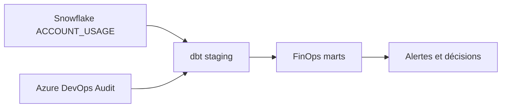

# Lab M13 — Observabilité et FinOps as Code avec dbt

**Durée :** 90 min — Extension post-formation
**Code :** `finops/`, `azure-pipelines.yml`
**Pattern :** Metadata-Driven Observability
**Piliers WAF :** Optimisation des coûts, Excellence opérationnelle
**Phase CAF :** Manage

## Contexte métier

Le propriétaire de la plateforme doit attribuer les crédits consommés, détecter les warehouses inactifs et prévenir un dépassement avant la facture. Des exports manuels ne fournissent ni historique fiable ni contrôle continu.

## Contexte architecture



## Objectifs pédagogiques

- Expliquer la latence de 1 à 3 heures des vues `ACCOUNT_USAGE`.
- Construire et tester les modèles `finops` existants.
- Interpréter crédits, requêtes coûteuses, stockage et warehouses inactifs.
- Relier Resource Monitors, tags et coût par équipe.
- Exécuter `dbt build` dans le stage Audit du pipeline.

## Concept — Pourquoi avant comment

Terraform définit les garde-fous de coût ; dbt transforme la télémétrie en indicateurs de décision. L'observabilité n'est pas un dashboard isolé : ses modèles, tests et seuils sont versionnés et déployés comme le reste de la plateforme.

## Pattern d'entreprise

**Metadata-Driven Observability** sépare les sources `ACCOUNT_USAGE`, une couche staging stable et des marts orientés décisions. L'alternative — requêtes SQL ponctuelles — est écartée car elle n'est ni testée, ni historisée, ni réutilisable.

## Implémentation

### Étape 1 — Préparer le profil sans secret versionné

Copiez `finops/profiles.yml.example` vers `~/.dbt/profiles.yml`. Remplacez uniquement les placeholders localement. En CI, injectez `SNOWFLAKE_*` depuis le Variable Group.

### Étape 2 — Vérifier les sources et la latence

```powershell
Set-Location finops
python -m pip install -r requirements.txt
dbt deps
dbt debug --target dev
```

Les modèles staging lisent `WAREHOUSE_METERING_HISTORY`, `QUERY_HISTORY`, `STORAGE_USAGE` et `RESOURCE_MONITORS`.

### Étape 3 — Construire la couche FinOps

```powershell
dbt build --target dev
dbt show --select mart_warehouse_credits_daily --limit 10
dbt show --select mart_resource_monitor_risk --limit 10
dbt show --select mart_expensive_queries --limit 10
```

### Étape 4 — Relier contrôle préventif et observation

Vérifiez que chaque warehouse géré par le module `landing-zone` est attaché à un Resource Monitor et que les tags `environment`, `team` et `cost_center` permettent l'attribution.

## Validation

### Résultat attendu

`dbt build` termine sans erreur ; les cinq marts existent et les statuts de risque sont bornés par les tests.

### Vérification Snowflake

```sql
SELECT * FROM DB_FINOPS_DEV.MARTS.MART_WAREHOUSE_CREDITS_DAILY ORDER BY USAGE_DATE DESC LIMIT 10;
SELECT * FROM DB_FINOPS_DEV.MARTS.MART_INACTIVE_WAREHOUSES WHERE ACTIVITY_STATUS <> 'ACTIVE';
SELECT * FROM DB_FINOPS_DEV.MARTS.MART_RESOURCE_MONITOR_RISK WHERE RISK_STATUS IN ('WARNING', 'CRITICAL');
```

### Critères d'acceptation

- [ ] `dbt debug` valide connexion, rôle, database, warehouse et schema.
- [ ] `dbt build` exécute modèles et tests.
- [ ] Les résultats sont interprétés avec la latence `ACCOUNT_USAGE`.
- [ ] Le pipeline Audit exécute le même build.
- [ ] Aucune valeur secrète n'est présente dans Git.

## Troubleshooting

| Symptôme | Diagnostic | Récupération | Prévention |
|---|---|---|---|
| Source vide | Vérifier la fenêtre temporelle et la latence | Attendre la disponibilité `ACCOUNT_USAGE` | Documenter la fraîcheur attendue |
| `insufficient privileges` | `SHOW GRANTS TO ROLE` | Accorder les privilèges de monitoring au rôle de gouvernance | Rôle FinOps dédié |
| Profil introuvable | `dbt debug --config-dir` | Placer `profiles.yml` hors du dépôt | Variables CI et Key Vault |
| Test de plage en échec | Examiner le modèle et la source | Corriger le calcul, pas le test | Revue des seuils |

Voir aussi `troubleshooting.md`.

## Notes d'architecte

`ACCOUNT_USAGE` convient à l'analyse et au pilotage, pas à l'alerte temps réel. Les seuils 75/90/100/110 % restent appliqués par les Resource Monitors ; dbt fournit tendance, attribution et preuve d'audit.

## Bonnes pratiques Enterprise

- Utiliser un warehouse FinOps dédié et auto-suspendu.
- Exécuter les tests avec chaque évolution de modèle.
- Taguer les coûts par environnement, domaine et équipe.
- Conserver les définitions de métriques dans Git.

## Notes de production

| Training | Production |
|---|---|
| `ACCOUNTADMIN` possible en sandbox | Rôle `GOVERNANCE` dédié avec privilèges minimaux |
| Profil local par mot de passe | JWT et secret Key Vault injecté en CI |
| Lecture ponctuelle | Build planifié, alertes et SLO de fraîcheur |

## Réflexion

1. Quel délai de détection est acceptable pour un dépassement de crédits ?
2. Comment attribuer un warehouse partagé à plusieurs domaines ?
3. Quels indicateurs doivent bloquer la création d'un nouveau Data Product ?

