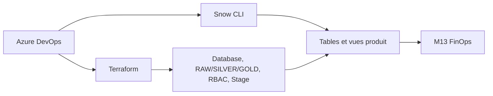

# Lab M14 — Data Products as Code avec Terraform et Snow CLI

| Élément | Valeur |
|---|---|
| **Durée** | 120 min |
| **Piste** | `[EXTENSION]` |
| **Workspace** | `$HOME/Data2AI-Labs/data-platform` (le clone) |
| **Dossier de travail** | `modules/data-product/` et `environments/dev/` |
| **Coût** | Warehouses X-SMALL |
| **Cleanup** | Détruire à la fin |

## Mission

Les domaines SALES et FINANCE doivent livrer des données avec autonomie sans contourner sécurité, coûts et standards. Vous allez créer un module `data-product` qui déploie la structure (database, schemas RAW/SILVER/GOLD, rôles, stage) et publier le contenu SQL avec Snow CLI.

## Architecture



## Objectifs

- créer un module `data-product` réutilisable;
- déployer deux domaines (SALES et FINANCE) avec `for_each`;
- implémenter l'architecture Medallion (RAW, SILVER, GOLD);
- publier le contenu SQL avec Snow CLI, pas avec `local-exec`;
- vérifier ownership, rôles, Future Grants et zero-drift.

## Prérequis

- [ ] M12 terminé : la plateforme est déployée;
- [ ] M13 terminé (recommandé) : FinOps est configuré;
- [ ] `snow sql -c training` fonctionne.

## Partie 1 — Créer le module data-product

### Étape 1.1 — Créer la structure

```bash
cd $HOME/Data2AI-Labs/data-platform
mkdir -p modules/data-product
```

### Étape 1.2 — Créer `modules/data-product/variables.tf`

```hcl
variable "learner_prefix" {
  type        = string
  description = "Learner prefix"
}

variable "environment" {
  type        = string
  description = "Deployment environment"
  default     = "DEV"
}

variable "domain" {
  type        = string
  description = "Domain name (e.g. SALES, FINANCE)"
}

variable "owner" {
  type        = string
  description = "Domain owner email"
}

variable "warehouse_size" {
  type        = string
  default     = "X-SMALL"
}
```

### Étape 1.3 — Créer `modules/data-product/main.tf`

```hcl
locals {
  db_name   = "${var.learner_prefix}_${var.domain}_${var.environment}"
  wh_name   = "WH_${var.learner_prefix}_${var.domain}_${var.environment}"
  role_prod = "ROLE_${var.learner_prefix}_${var.domain}_PROD_${var.environment}"
  role_read = "ROLE_${var.learner_prefix}_${var.domain}_RDR_${var.environment}"
  comment   = "Data Product | ${var.domain} | Owner: ${var.owner}"
}

# Database
resource "snowflake_database" "this" {
  name    = local.db_name
  comment = local.comment
}

# Medallion schemas
resource "snowflake_schema" "raw" {
  database = snowflake_database.this.name
  name     = "RAW"
  comment  = local.comment
}

resource "snowflake_schema" "silver" {
  database = snowflake_database.this.name
  name     = "SILVER"
  comment  = local.comment
}

resource "snowflake_schema" "gold" {
  database = snowflake_database.this.name
  name     = "GOLD"
  comment  = local.comment
}

# Warehouse
resource "snowflake_warehouse" "this" {
  name                = local.wh_name
  warehouse_size      = var.warehouse_size
  auto_suspend        = 60
  auto_resume         = true
  initially_suspended = true
  comment             = local.comment
}

# Roles
resource "snowflake_account_role" "producer" {
  name    = local.role_prod
  comment = "Producer role for ${var.domain}"
}

resource "snowflake_account_role" "reader" {
  name    = local.role_read
  comment = "Reader role for ${var.domain}"
}

# Grants
resource "snowflake_grant_privileges_to_account_role" "producer_db" {
  privileges        = ["USAGE"]
  account_role_name = snowflake_account_role.producer.name
  on_database       = snowflake_database.this.name
}

resource "snowflake_grant_privileges_to_account_role" "producer_schemas" {
  for_each = toset(["RAW", "SILVER", "GOLD"])

  privileges        = ["USAGE", "CREATE TABLE", "CREATE VIEW"]
  account_role_name = snowflake_account_role.producer.name
  on_schema {
    schema_name = "${snowflake_database.this.name}.${each.value}"
  }
}

resource "snowflake_grant_privileges_to_account_role" "reader_db" {
  privileges        = ["USAGE"]
  account_role_name = snowflake_account_role.reader.name
  on_database       = snowflake_database.this.name
}

# Future Grants: new tables in GOLD get SELECT for reader
resource "snowflake_grant_privileges_to_account_role" "reader_future_gold" {
  privileges        = ["SELECT"]
  account_role_name = snowflake_account_role.reader.name
  on_schema_object {
    future {
      database_name = snowflake_database.this.name
      schema_name   = "GOLD"
      object_type   = "TABLE"
    }
  }
}

# Stage for raw ingestion
resource "snowflake_stage" "raw" {
  name     = "STG_RAW"
  database = snowflake_database.this.name
  schema   = "RAW"
  comment  = local.comment
}
```

### Étape 1.4 — Créer `modules/data-product/outputs.tf`

```hcl
output "database_name" {
  value = snowflake_database.this.name
}

output "warehouse_name" {
  value = snowflake_warehouse.this.name
}

output "role_producer" {
  value = snowflake_account_role.producer.name
}

output "role_reader" {
  value = snowflake_account_role.reader.name
}

output "stage_name" {
  value = snowflake_stage.raw.name
}
```

### Étape 1.5 — Créer `modules/data-product/versions.tf`

```hcl
terraform {
  required_version = ">= 1.14.0, < 2.0.0"

  required_providers {
    snowflake = {
      source  = "snowflakedb/snowflake"
      version = "= 2.14.0"
    }
  }
}
```

### Étape 1.6 — Formater et valider

```bash
cd modules/data-product
terraform fmt
terraform validate
```

## Partie 2 — Déployer deux domaines avec for_each

### Étape 2.1 — Ajouter l'appel dans `environments/dev/main.tf`

```hcl
locals {
  data_products = {
    SALES = {
      owner = "sales@data2ai.com"
    }
    FINANCE = {
      owner = "finance@data2ai.com"
    }
  }
}

module "data_product" {
  source   = "../../modules/data-product"
  for_each = local.data_products

  learner_prefix = var.learner_prefix
  environment    = var.environment
  domain         = each.key
  owner          = each.value.owner
  warehouse_size = "X-SMALL"
}
```

### Étape 2.2 — Ajouter les outputs

```hcl
output "data_products" {
  value = {
    for k, v in module.data_product : k => {
      database  = v.database_name
      warehouse = v.warehouse_name
      producer  = v.role_producer
      reader    = v.role_reader
    }
  }
  description = "Deployed data products"
}
```

### Étape 2.3 — Planifier et appliquer

```bash
cd environments/dev
terraform fmt
terraform init
terraform validate
terraform plan
terraform apply
```

**Attendu :** 2 databases, 6 schemas, 2 warehouses, 4 rôles, 2 stages, grants.

### Étape 2.4 — Vérifier

```bash
snow sql -c training -q "SHOW DATABASES LIKE 'ABC_SALES_DEV'"
snow sql -c training -q "SHOW DATABASES LIKE 'ABC_FINANCE_DEV'"
snow sql -c training -q "SHOW SCHEMAS IN DATABASE ABC_SALES_DEV"
```

## Partie 3 — Publier le contenu SQL avec Snow CLI

### Étape 3.1 — Créer les fichiers SQL

```bash
mkdir -p sql/sales sql/finance
```

`sql/sales/orders.sql` :

```sql
CREATE OR REPLACE TABLE ABC_SALES_DEV.SILVER.ORDERS AS
SELECT
  1 AS ORDER_ID,
  '2026-01-01' AS ORDER_DATE,
  100.00 AS AMOUNT
UNION ALL
SELECT 2, '2026-01-02', 200.00;

CREATE OR REPLACE VIEW ABC_SALES_DEV.GOLD.DAILY_REVENUE AS
SELECT
  ORDER_DATE,
  SUM(AMOUNT) AS TOTAL_REVENUE
FROM ABC_SALES_DEV.SILVER.ORDERS
GROUP BY ORDER_DATE;
```

`sql/finance/ledger.sql` :

```sql
CREATE OR REPLACE TABLE ABC_FINANCE_DEV.SILVER.LEDGER AS
SELECT
  1 AS ENTRY_ID,
  '2026-01-01' AS ENTRY_DATE,
  'REVENUE' AS TYPE,
  300.00 AS AMOUNT;
```

### Étape 3.2 — Exécuter le SQL avec Snow CLI

```bash
snow sql -c training -f sql/sales/orders.sql
snow sql -c training -f sql/finance/ledger.sql
```

### Étape 3.3 — Vérifier

```bash
snow sql -c training -q "SELECT * FROM ABC_SALES_DEV.GOLD.DAILY_REVENUE"
snow sql -c training -q "SELECT * FROM ABC_FINANCE_DEV.SILVER.LEDGER"
```

### Étape 3.4 — Prouver le zero-drift

```bash
terraform plan -detailed-exitcode
```

**Attendu :** code 0 — le SQL publié ne modifie pas la structure gérée par Terraform.

> C'est la séparation des responsabilités : Terraform gère la structure, Snow CLI gère le contenu.

## Partie 4 — Vérifier les Future Grants

### Étape 4.1 — Lister les Future Grants

```bash
snow sql -c training -q "SHOW FUTURE GRANTS IN SCHEMA ABC_SALES_DEV.GOLD"
```

**Attendu :** `GRANT SELECT ON FUTURE TABLES TO ROLE ROLE_ABC_SALES_RDR_DEV`.

### Étape 4.2 — Tester le Future Grant

Créez une table manuellement dans GOLD :

```bash
snow sql -c training -q "CREATE TABLE ABC_SALES_DEV.GOLD.TEST_FUTURE (ID INT)"
snow sql -c training -q "SHOW GRANTS ON TABLE ABC_SALES_DEV.GOLD.TEST_FUTURE"
```

**Attendu :** le rôle reader a déjà SELECT grâce au Future Grant.

### Étape 4.3 — Nettoyer

```bash
snow sql -c training -q "DROP TABLE ABC_SALES_DEV.GOLD.TEST_FUTURE"
```

## Challenge

Ajoutez un troisième domaine `MARKETING` avec un owner et un warehouse dédié. Publiez une vue `CAMPAIGN_PERFORMANCE` dans le schema GOLD.

Critères :

- [ ] `terraform plan` crée les ressources MARKETING;
- [ ] `snow sql -f` publie la vue;
- [ ] `terraform plan -detailed-exitcode` retourne 0;
- [ ] le Future Grant est configuré pour le reader.

## Cleanup

```bash
cd environments/dev
terraform destroy
```

```bash
snow sql -c training -q "DROP DATABASE ABC_SALES_DEV"
snow sql -c training -q "DROP DATABASE ABC_FINANCE_DEV"
```
