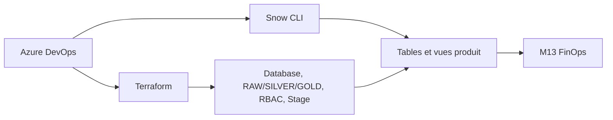

# Lab M14 — Data Products as Code avec Terraform et Snow CLI

**Durée :** 120 min — Extension post-formation
**Code :** `project/06-data-products/`
**Pattern :** Data Product, Data Mesh, Medallion Architecture
**Piliers WAF :** Les cinq piliers
**Phase CAF :** Adopt

## Contexte métier

Les domaines SALES et FINANCE doivent livrer des données avec autonomie sans contourner sécurité, coûts et standards. La plateforme publie un contrat structurel ; les équipes produit publient leur SQL versionné à travers la même chaîne de contrôle.

## Contexte architecture



## Objectifs pédagogiques

- Expliquer la frontière Terraform/Snow CLI.
- Déployer un produit de domaine via un module réutilisable.
- Implémenter RAW, SILVER et GOLD selon Medallion.
- Publier tables et vues par SQL versionné.
- Vérifier ownership, rôles, Future Grants et zero-drift.

## Concept — Pourquoi avant comment

Terraform excelle pour les objets structurels à cycle de vie long : databases, schemas, stages, rôles et grants. Snow CLI convient aux artefacts SQL qui évoluent avec le produit. Mélanger les deux cycles dans des `local-exec` détruit la lisibilité du plan et la reprise sur erreur.

## Pattern d'entreprise

Le pattern **Data Product** attribue un owner, un contrat, des rôles et des indicateurs à un domaine. **Medallion** matérialise les niveaux RAW, SILVER et GOLD. Le **Data Mesh** fédère ces produits sous les garde-fous de la plateforme.

## Implémentation

### Étape 1 — Valider le module structurel

```powershell
terraform -chdir=project/06-data-products/environments/dev init -backend=false
terraform -chdir=project/06-data-products/environments/dev validate
terraform -chdir=project/06-data-products/environments/dev plan
```

Le root instancie `module.data_product` avec `for_each` pour SALES et FINANCE.

### Étape 2 — Appliquer la structure

```powershell
terraform -chdir=project/06-data-products/environments/dev apply
terraform -chdir=project/06-data-products/environments/dev output data_products
```

### Étape 3 — Publier le contenu SQL

```powershell
snow sql -f project/06-data-products/sql/sales/orders.sql --database DB_SALES_DEV --warehouse WH_ETL_DEV
snow sql -f project/06-data-products/sql/finance/ledger.sql --database DB_FINANCE_DEV --warehouse WH_ETL_DEV
```

### Étape 4 — Prouver la séparation des responsabilités

Le rôle producteur écrit et transforme ; le rôle lecteur consomme les futures tables. Les providers `sysadmin` et `securityadmin` séparent objets et autorisations.

## Validation

```sql
SHOW SCHEMAS IN DATABASE DB_SALES_DEV;
SHOW GRANTS TO ROLE RL_SALES_READER_DEV;
SHOW FUTURE GRANTS IN DATABASE DB_SALES_DEV;
SELECT * FROM DB_SALES_DEV.GOLD.DAILY_REVENUE LIMIT 10;
```

### Critères d'acceptation

- [ ] SALES et FINANCE possèdent RAW, SILVER et GOLD.
- [ ] Chaque domaine possède un stage RAW et une paire de rôles.
- [ ] Le SQL est déployé avec Snow CLI, pas avec `local-exec`.
- [ ] `terraform plan` retourne `No changes` après publication SQL.
- [ ] DEV et TEST utilisent des states et des noms distincts.

## Troubleshooting

| Symptôme | Diagnostic | Récupération | Prévention |
|---|---|---|---|
| Warehouse absent | `SHOW WAREHOUSES LIKE 'WH_ETL_%'` | Déployer M12 avant M14 | Dépendance documentée |
| Preview stage refusée | Vérifier provider 2.14.0 | Réinitialiser avec la version verrouillée | Matrice CI |
| SQL dans le mauvais contexte | `SELECT CURRENT_DATABASE(), CURRENT_ROLE()` | Passer explicitement database/warehouse | Paramètres CLI obligatoires |
| Grant manquant | `SHOW GRANTS TO ROLE` | Corriger le module et réappliquer | Aucun grant manuel permanent |

Voir `troubleshooting.md` pour la récupération détaillée.

## Notes d'architecte

La frontière Terraform/Snow CLI est une décision de cycle de vie : Terraform publie le contrat stable ; Snow CLI publie le contenu à fréquence élevée. Le pipeline orchestre les deux sans masquer le SQL dans le state.

## Bonnes pratiques Enterprise

- Un owner, un SLA et un coût attribuable par produit.
- Contrats de schéma compatibles en arrière.
- Rôles producteur/lecteur dédiés, Future Grants testés.
- Promotion DEV → TEST → PROD à partir du même commit.

## Notes de production

| Training | Production |
|---|---|
| Stage interne | Storage Integration Azure et Private Endpoint selon exigences |
| Deux domaines | Catalogue de domaines piloté par métadonnées |
| SQL séquentiel | Tests de contrat, approbation et rollback |
| JWT local | Workload identity et Key Vault |

## Réflexion

1. Qui approuve une rupture de contrat GOLD ?
2. Comment un produit expose-t-il fraîcheur, qualité et coût ?
3. Quel garde-fou reste central et lequel appartient au domaine ?

