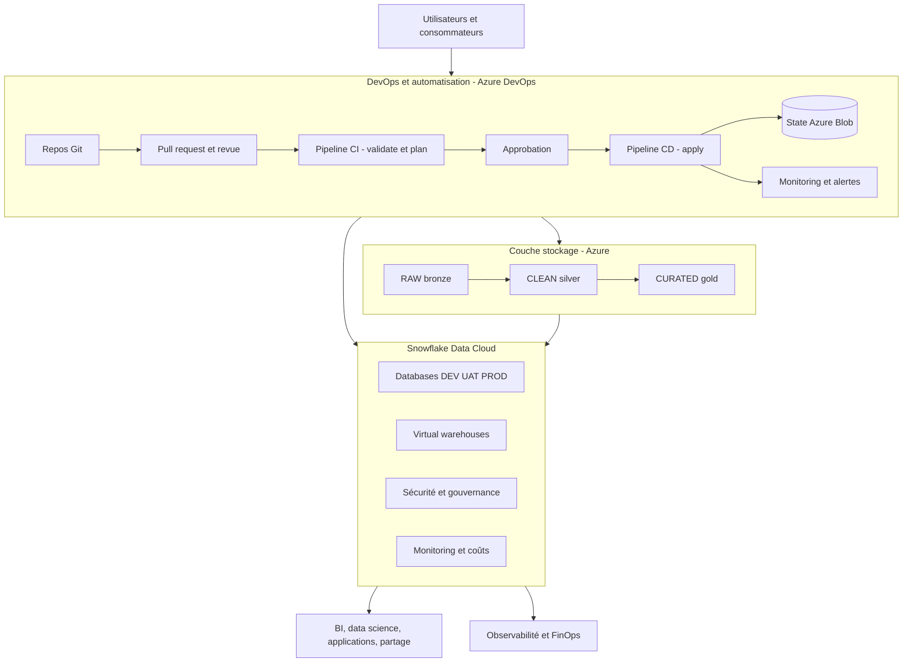
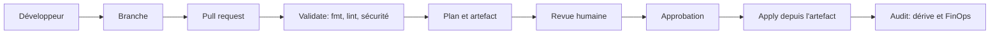

# Architecture de référence — Data Platform as Code

Cette architecture est la cible réelle de l'entreprise. La formation la construit progressivement, du premier fichier Terraform jusqu'au capstone.

**Principes :** automatisation d'abord, sécurité dès la conception, gouvernance des données, élasticité, optimisation des coûts, résilience et traçabilité.

## Vue d'ensemble

## 1. Compte Snowflake unique

L'entreprise utilise **un seul compte Snowflake** et isole les environnements par **convention de nommage**, pas par comptes séparés.

| Environnement | Rôle | Caractéristiques |
|---|---|---|
| `DEV` | Développement | Itératif, coûts limités, données non sensibles |
| `UAT` | Validation | Pré-production, tests d'acceptation |
| `PROD` | Production | Haute disponibilité, sécurité renforcée |

Conséquences directes :

- toute ressource porte le suffixe ou préfixe d'environnement;
- une erreur de nommage peut affecter un autre environnement;
- le RBAC doit empêcher qu'un rôle DEV touche PROD;
- en formation, un **préfixe apprenant** s'ajoute pour éviter les collisions.

## 2. Terraform et gestion de l'état

| Élément | Choix entreprise |
|---|---|
| Backend | Azure Blob Storage |
| Isolation | Une clé de state distincte par environnement |
| Verrouillage | Mécanisme natif du backend |
| Chiffrement | Chiffrement du stockage au repos |
| Accès | Identité gérée, pas de secret partagé |

Le state contient des métadonnées sensibles. Il n'est jamais commité, jamais édité à la main, et jamais partagé par fichier.

## 3. Gestion des secrets

| Élément | Choix entreprise |
|---|---|
| Coffre | Azure Key Vault |
| Contenu | Clés privées RSA des identités techniques Snowflake |
| Accès | RBAC Azure |
| Protection | Suppression réversible et protection contre la purge |
| Rotation | Versionnée et planifiée |

En formation, un PAT temporaire est utilisé au Day 0 pour démarrer sans friction. L'authentification cible **JWT key-pair avec clé stockée dans Key Vault** est construite au Jour 4, une fois le RBAC compris.

## 4. CI/CD Azure DevOps

Règles :

- aucun `apply` sans plan revu;
- le plan appliqué est exactement celui approuvé;
- les agents exécutent Terraform, Snow CLI et dbt;
- l'authentification Azure utilise la fédération d'identité, sans secret client stocké;
- la détection de dérive s'exécute après chaque déploiement.

### Policy as Code

| Contrôle | Objectif |
|---|---|
| Lint | Conventions et erreurs courantes |
| Validate | Configuration syntaxiquement correcte |
| Scan sécurité | Mauvaises configurations |
| Estimation de coût | Impact financier avant apply |
| Politiques | Règles d'entreprise obligatoires |

## 5. Couches de données

| Couche | Contenu | Garanties |
|---|---|---|
| RAW / Bronze | Données brutes immuables | Auditabilité et traçabilité |
| CLEAN / Silver | Données nettoyées et conformées | Qualité et déduplication |
| CURATED / Gold | Entités métier agrégées | Prêt pour l'analyse |

## 6. Sécurité et gouvernance

| Domaine | Mise en œuvre |
|---|---|
| Identité | Fournisseur d'identité d'entreprise, SSO et MFA |
| Rôles Snowflake | Rôles de compte, rôles de base et privilèges objets |
| Accès fin | Masquage dynamique et politiques d'accès aux lignes |
| Réseau | Liaison privée, listes d'adresses autorisées, network policies |
| Chiffrement | Au repos et en transit |
| Audit | Historique d'accès, de requêtes et de connexions |
| Conformité | Tags, classification et rétention |

Principe appliqué partout : **moindre privilège**. Un rôle d'administration n'est utilisé que pour les opérations qui l'exigent réellement.

## 7. Observabilité et FinOps

| Source | Usage |
|---|---|
| `ACCOUNT_USAGE` | Crédits, requêtes, stockage |
| Resource monitors | Plafonds et alertes |
| dbt | Modèles de coûts et indicateurs |
| Monitoring Azure | Journaux des pipelines et alertes |

Indicateurs suivis : crédits par warehouse, warehouses inactifs, requêtes coûteuses, tendance de stockage, risque de dépassement de quota.

## 8. Correspondance avec la formation

| Jour | Bloc d'architecture construit |
|---|---|
| Jour 1 | Premier projet Terraform et objets Snowflake de base |
| Jour 2 | State, backend Azure, import et dérive |
| Jour 3 | Modules réutilisables et environnements DEV/UAT/PROD |
| Jour 4 | RBAC, identité technique, Key Vault et ingestion |
| Jour 5 | Pipeline Azure DevOps, FinOps, Data Products et capstone |

## 9. Ce que la formation simplifie

| Production | Formation | Raison |
|---|---|---|
| Identités fédérées d'entreprise | PAT temporaire au Day 0 | Démarrer sans blocage d'accès |
| Liaison privée réseau | Accès public restreint | Absence d'infrastructure réseau dédiée |
| Volumes de données réels | Jeux réduits | Coût et durée |
| Approbations multi-équipes | Approbation simulée | Une seule promotion d'apprenants |

Chaque simplification est signalée dans le support concerné, avec la pratique de production correspondante.
