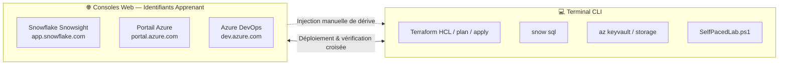

# 📋 Plan d'Implémentation — Parcours Data Platform Azure · Terraform · Snowflake · Azure DevOps

> **Version :** 2026-09-03  
> **Références :** [`PLAN.md`](PLAN.md) · [`COURSES_ANALYSIS_AND_RECOMMENDATIONS.md`](COURSES_ANALYSIS_AND_RECOMMENDATIONS.md) · [`courses/_templates/lab.template.md`](courses/_templates/lab.template.md)  
> **Stack obligatoire :** Microsoft Azure · Terraform · Snowflake Enterprise · Azure DevOps  
> **Pédagogie :** 80 % Pratique / 20 % Micro-Théorie · Autoformation guidée (*Self-Paced*) · Terminal CLI + Consoles Web

---

## 🎯 Objectif du Plan

Transformer le référentiel existant en un parcours d'autoformation exécutable module par module, où chaque apprenant alterne entre **ligne de commande** (Terraform, Snowflake CLI, Azure CLI) et **consoles Web officielles** (Snowsight, Portail Azure, Azure DevOps) pour valider, perturber et réparer son infrastructure.

---

## 🏛️ Contraintes du Plan

- **Stack exclusive** : tous les labs pratiques s'exécutent sur **Azure + Terraform + Snowflake + Azure DevOps**.
- **AWS et GCP** restent des annexes comparatives d'architecture, sans lab exécutable obligatoire.
- **Convention de nommage** : `<PREFIXE>_<ZONE>_<ENV>` (ex. `APP01_RAW_DEV`).
- **FinOps** : warehouses `X-SMALL`, `auto_suspend = 60`, `initially_suspended = true`.
- **Secrets** : jamais en dur dans le code — Azure Key Vault + profils Snowflake CLI.
- **State** : Azure Blob Storage chiffré avec *Blob Lease Lock*.

---

## 🗺️ Feuille de Route Générale

| Phase | Durée estimée | Objectif | Livrables clés |
|---|---|---|---|
| **Phase 1** | 2-3 jours | Standardiser les 15 `lab.md` au template 80% Labs | `courses/day-XX/module-XX-*/lab.md` réécrits avec Pre-flight, Micro-Steps, Plan décrypté, Preuve Web UI, Chaos Lab, Défi, Teardown |
| **Phase 2** | 1-2 jours | Compléter le moteur d'auto-évaluation | `validate.sh` pour M02-M14 + tests de `SelfPacedLab.ps1 -Module X -All -Report` |
| **Phase 3** | 1 jour | Enrichir l'expérience hybride Console Web | Captures/guides des consoles Snowsight, Azure, Azure DevOps dans chaque `lab.md` |
| **Phase 4** | 1-2 jours | Finaliser la documentation & grading | Mise à jour de `PROGRAMME_FORMATION.md`, `TRAINING_PROGRAM.md`, grille du Capstone M12 |

---

## 🧩 Architecture d'Exécution Hybride



| Console | Usage normal | Usage Chaos Lab |
|---|---|---|
| **Snowflake Snowsight** | Vérifier warehouses, databases, rôles, Query History, masquage dynamique | Modifier un paramètre à la souris (taille warehouse, commentaire) pour observer le *drift* au prochain `terraform plan` |
| **Portail Microsoft Azure** | Auditer le state Blob, le bail de verrouillage, Azure Key Vault, ADLS Gen2, Resource Group | Révoquer temporairement un rôle RBAC et observer l'erreur 403 |
| **Azure DevOps Web** | Créer des PR, lire le plan généré, cliquer sur *Approve* d'un *Environment Gate* PROD | Pousser une PR avec une erreur de formatage et constater le blocage du pipeline |

---

## 📑 Standard du Template Universel `lab.md`

Chaque `lab.md` doit impérativement contenir les 9 sections suivantes :

1. **Header métrique** : durée, coût estimé, prérequis, certifications.
2. **Mission métier & User Story**.
3. **Architecture & modèle mental** (diagramme Mermaid).
4. **Pre-Flight Diagnostic** (PowerShell + Bash).
5. **Micro-Steps HCL atomiques** (1 action = 1 vérification CLI + 1 vérification console).
6. **Plan décrypté** : lecture des symboles `+`, `~`, `-`, `-/+`.
7. **Preuve hybride** : commande `snow sql` / `az` + étapes dans Snowsight / Azure Portal / Azure DevOps.
8. **Chaos Lab** : injection de panne, diagnostic, runbook de correction.
9. **Validation automatisée** (`SelfPacedLab.ps1 -Module X -All`) + Défi autonome sur 100 pts + Teardown FinOps.

---

## 🔬 Analyse & Actions par Module (M00 à M14)

### JOUR 0 — Préparation & Toolchain

#### M00 — Setup & Audit d'Environnement

| Élément | État actuel | Action d'implémentation |
|---|---|---|
| `lab.md` | Existe, script monolithique, messages d'erreur globaux | Découper en 5 micro-étapes avec checkpoint atomique : Git, Terraform, Azure CLI, Snowflake CLI, `.env`/Key Vault |
| `course.md` / `slides.md` | Existent | Réduire la théorie à 10 min, ajouter le modèle mental d'isolation `<PREFIXE>_<ZONE>_<ENV>` |
| `validate.ps1` | ✅ Existe et fonctionne | Conserver ; s'assurer que les 5 checkpoints atomiques sont testés (`git`, `terraform`, `snow`, `az`, `.env`) |
| `validate.sh` | ✅ Existe | Conserver ; aligner sur `validate.ps1` si nécessaire |
| Console Web | Absent | Ajouter la connexion à **Snowsight** avec login/mot de passe apprenant et activation du rôle `SYSADMIN` |
| Chaos Lab | Absent | Injecter `LEARNER_PREFIX=toolongprefix12345` dans `.env`, observer le rejet regex, corriger |

**Commandes de référence :**
```powershell
az keyvault secret show --vault-name "<KEYVAULT_NAME>" --name "SnowflakePAT-APP01" --query "value" -o tsv
snow connection test -c training
```

---

### JOUR 1 — Fondations IaC, State & Variables

#### M01 — Premier Déploiement & Idempotence

| Élément | État actuel | Action d'implémentation |
|---|---|---|
| `lab.md` | Existe, bonne base, mais trop de fichiers d'un coup | Découper en 5 micro-étapes : `versions.tf` strict, `provider.tf` sans secrets, `main.tf` database, schema, warehouse X-SMALL |
| `validate.ps1` | ✅ Existe | Ajouter un test d'idempotence : `terraform plan -detailed-exitcode` doit retourner `0` |
| `validate.sh` | ✅ Existe | Aligner sur `validate.ps1` |
| Preuve Web | Absent | Ajouter : dans **Snowsight** > *Admin > Warehouses*, vérifier `APP01_ETL_DEV` *Suspended* et *X-Small* |
| Chaos Lab | Partiel | Formaliser : modifier la taille dans Snowsight UI → `terraform plan` détecte `~ warehouse_size` → `terraform apply` restaure |

**HCL cible :**
```hcl
resource "snowflake_warehouse" "etl" {
  name                = "${var.learner_prefix}_ETL_${var.environment}"
  warehouse_size      = "X-SMALL"
  auto_suspend        = 60
  initially_suspended = true
}
```

---

#### M02 — State Distant sur Azure Blob Storage & Verrouillage

| Élément | État actuel | Action d'implémentation |
|---|---|---|
| `lab.md` | Existe, migration de state bien posée | Ajouter l'inspection du bail Azure dans le Portail Web et le scénario de concurrence |
| `validate.ps1` | ✅ Existe | Vérifier qu'il teste : backend azurerm actif, fichier `.tfstate` distant, state local supprimé |
| `validate.sh` | ❌ Manquant | **Créer** le pendant Bash |
| Console Web | Absent | Ajouter : dans **Portail Azure** > *Storage Account > Containers > tfstate*, auditer `APP01/m02.terraform.tfstate` et *Lease status* |
| Chaos Lab | Partiel | Formaliser : deux terminaux lancent `terraform plan`, observer `Error acquiring the state lock`, apprendre `terraform force-unlock` |

---

#### M03 — Brownfield Import & Alignement de Dérive

| Élément | État actuel | Action d'implémentation |
|---|---|---|
| `lab.md` | Existe, utilise encore `terraform import` impératif | Migrer vers la syntaxe déclarative `import {}` de Terraform 1.5+ et `terraform plan -generate-config-out=generated.tf` |
| `validate.ps1` | ✅ Existe | Vérifier qu'il contrôle le bloc `import {}`, la présence de la ressource importée et le plan `0 to add, 0 to change, 0 to destroy` |
| `validate.sh` | ❌ Manquant | **Créer** le pendant Bash |
| Preuve Web | Absent | Ajouter : créer le schema *legacy* d'abord dans **Snowsight** via SQL Worksheet, puis importer |
| Chaos Lab | Absent | Tenter un `id` avec mauvaise casse (`app01_raw_dev.legacy_staging` vs `APP01_RAW_DEV.LEGACY_STAGING`), observer l'erreur Snowflake, corriger |

---

#### M04 — Variables, Types Complexes & Moteur de Validation

| Élément | État actuel | Action d'implémentation |
|---|---|---|
| `lab.md` | Existe, bien structuré | Renforcer avec validations FinOps concrètes et outputs sensibles |
| `validate.ps1` | ✅ Existe | Vérifier les règles de validation HCL et `sensitive = true` sur les outputs |
| `validate.sh` | ❌ Manquant | **Créer** le pendant Bash |
| Console Web | Absent | Ajouter : la validation bloquante s'arrête en local, sans appel réseau — montrer qu'il n'y a pas d'objet créé dans Snowsight |
| Chaos Lab | Partiel | Formaliser : `terraform plan -var="warehouse_size=MEDIUM"` doit être rejeté avec le message personnalisé |

**HCL cible :**
```hcl
variable "warehouse_size" {
  type    = string
  default = "XSMALL"
  validation {
    condition     = contains(["XSMALL", "SMALL"], var.warehouse_size)
    error_message = "FinOps policy: Seuls XSMALL et SMALL sont autorisés en formation."
  }
}

variable "learner_prefix" {
  type    = string
  validation {
    condition     = can(regex("^[A-Z0-9]{2,10}$", var.learner_prefix))
    error_message = "Le préfixe doit être alphanumérique majuscule de 2 à 10 caractères."
  }
}
```

---

### JOUR 2 — Industrialisation, Modules & CI/CD Azure

#### M05 — Modules Réutilisables & Pattern Landing Zone

| Élément | État actuel | Action d'implémentation |
|---|---|---|
| `lab.md` | Existe | Clarifier la séparation root / child module, le contrat inputs/outputs |
| `validate.ps1` | ✅ Existe | Vérifier l'existence du dossier `modules/landing-zone/`, des `variables.tf`/`outputs.tf` et l'appel `module "landing_zone"` |
| `validate.sh` | ❌ Manquant | **Créer** le pendant Bash |
| Console Web | Absent | Ajouter : dans **Snowsight**, constater que les objets existent toujours après refactoring, sans recréation |
| Chaos Lab | Absent | Modifier la signature d'une variable obligatoire du module sans mettre à jour l'appelant, observer `terraform validate` |

---

#### M06 — Logique Dynamique & Meta-Arguments (`for_each`)

| Élément | État actuel | Action d'implémentation |
|---|---|---|
| `lab.md` | Existe, technique | Ajouter un exemple gradué `map(object)` et comparatif `count` vs `for_each` |
| `validate.ps1` | ✅ Existe | Vérifier l'usage de `for_each` (pas `count`) et la stabilité des clés nommées |
| `validate.sh` | ❌ Manquant | **Créer** le pendant Bash |
| Preuve Web | Absent | Ajouter : dans **Snowsight**, observer les 3 schemas `RAW`, `CLEAN`, `CURATED` créés dynamiquement |
| Chaos Lab | Absent | Supprimer `CLEAN` au milieu de la map, vérifier qu'une seule ressource est détruite sans toucher `CURATED` |

---

#### M07 — Pipeline CI/CD Azure DevOps

| Élément | État actuel | Action d'implémentation |
|---|---|---|
| `lab.md` | Existe, `labv2.md` potentiellement redondant | Unifier `lab.md` et `labv2.md` si besoin ; mettre l'accent sur **Azure DevOps Web** |
| `validate.ps1` | ✅ Existe | Vérifier la présence et la validité du `azure-pipelines.yml` |
| `validate.sh` | ❌ Manquant | **Créer** le pendant Bash |
| Console Web | Absent | Ajouter : créer la PR sur **dev.azure.com**, lire le plan Terraform dans la PR, cliquer sur *Approve* du gate PROD |
| Chaos Lab | Partiel | Formaliser : pousser une PR avec `terraform fmt` non respecté, observer le build failed et le blocage du merge |

---

#### M08 — Stratégie Multi-Environnements (DEV / UAT / PROD)

| Élément | État actuel | Action d'implémentation |
|---|---|---|
| `lab.md` | Existe | Renforcer l'isolation des states et la preuve de non-interférence |
| `validate.ps1` | ✅ Existe | Vérifier les clés de state distinctes (`dev.terraform.tfstate` vs `prod.terraform.tfstate`) |
| `validate.sh` | ❌ Manquant | **Créer** le pendant Bash |
| Console Web | Absent | Ajouter : dans **Portail Azure**, vérifier les 2 fichiers `.tfstate` distincts ; dans **Snowsight**, vérifier la coexistence `*_DEV` et `*_PROD` |
| Chaos Lab | Absent | Modifier `environments/dev/`, lancer `terraform plan` dans `environments/prod/`, prouver qu'il n'y a aucun changement |

---

### JOUR 3 — Sécurité, Secrets & Ingestion Azure

#### M09 — Ingestion de Données & Azure Data Lake Storage Gen2

| Élément | État actuel | Action d'implémentation |
|---|---|---|
| `lab.md` | Existe, riche | Clarifier le consentement Entra ID et le *Zero Shared Key* |
| `validate.ps1` | ✅ Existe | Vérifier `snowflake_storage_integration`, `snowflake_file_format`, `snowflake_stage` et un `COPY INTO` réussi |
| `validate.sh` | ❌ Manquant | **Créer** le pendant Bash |
| Console Web | Absent | Ajouter : uploader un Parquet dans **Portail Azure** ADLS Gen2, puis exécuter `LIST @stage` et `COPY INTO` dans **Snowsight** |
| Chaos Lab | Absent | Révoquer le rôle *Storage Blob Data Reader* sur le conteneur, observer l'erreur 403, restaurer |

---

#### M10 — Identité Technique, Clés RSA & Azure Key Vault

| Élément | État actuel | Action d'implémentation |
|---|---|---|
| `lab.md` | Existe | Renforcer la distinction clé privée / clé publique et la rotation zéro-downtime |
| `validate.ps1` | ✅ Existe | Vérifier : paire RSA 2048 générée, clé privée dans Azure Key Vault, `rsa_public_key` sur l'utilisateur Snowflake, auth JWT réussie |
| `validate.sh` | ❌ Manquant | **Créer** le pendant Bash |
| Console Web | Absent | Ajouter : dans **Portail Azure** vérifier le secret et ses versions ; dans **Snowsight** exécuter `DESCRIBE USER` et valider l'empreinte |
| Chaos Lab | Absent | Tenter une connexion avec une mauvaise clé privée, observer `JWT token is invalid`, auditer les logs |

---

### JOUR 4 — Gouvernance, RBAC, FinOps & Capstone

#### M11 — RBAC as Code & Sécurité au Moindre Privilège

| Élément | État actuel | Action d'implémentation |
|---|---|---|
| `lab.md` | Existe, bonne base théorique | Ajouter des tests unitaires de permissions automatisés |
| `validate.ps1` | ✅ Existe | Vérifier la matrice `AR_*` / `FR_*`, les *Future Grants* et les tests SQL positifs/négatifs |
| `validate.sh` | ❌ Manquant | **Créer** le pendant Bash |
| Console Web | Absent | Ajouter : dans **Snowsight**, basculer sur `FR_DATA_ANALYST`, tester `SELECT` (succès) et `DROP` (échec 403) |
| Chaos Lab | Absent | Oublier le privilège `USAGE` sur la database parente, observer que `SELECT` devient inaccessible, corriger |

---

#### M12 — Projet Fil Rouge (Enterprise Capstone)

| Élément | État actuel | Action d'implémentation |
|---|---|---|
| `lab.md` | Existe | Le transformer en cahier des charges autonome sans solution apparente, avec grille sur 100 pts |
| `validate.ps1` | ✅ Existe | Vérifier : assemblage des modules, state Azure Blob, Key Vault, RBAC, pipeline, `terraform plan` = 0 changes |
| `validate.sh` | ❌ Manquant | **Créer** le pendant Bash |
| Console Web | Absent | Ajouter l'audit global : **Azure Portal** (state + Key Vault), **Azure DevOps** (pipeline vert), **Snowsight** (plateforme complète) |
| Challenge | Partiel | Finaliser la rubrique de notation sur 100 pts : Syntaxe (30), Preuve fonctionnelle (30), Idempotence (20), FinOps/Sécurité (20) |

---

#### M13 — FinOps & Observabilité Snowflake avec dbt

| Élément | État actuel | Action d'implémentation |
|---|---|---|
| `lab.md` | Existe, moderne | Rendre la consommation de crédits concrète avec `SNOWFLAKE.ACCOUNT_USAGE.WAREHOUSE_METERING_HISTORY` |
| `validate.ps1` | ✅ Existe | Vérifier : `snowflake_resource_monitor` créé, rattaché aux warehouses, modèle dbt exécuté |
| `validate.sh` | ❌ Manquant | **Créer** le pendant Bash |
| Console Web | Absent | Ajouter : dans **Snowsight** > *Admin > Cost Management > Resource Monitors*, observer la jauge de crédits |
| Chaos Lab | Absent | Abaisser le quota sous la consommation courante, tenter de démarrer le warehouse, constater le blocage |

---

#### M14 — Data Products & Gouvernance des Données

| Élément | État actuel | Action d'implémentation |
|---|---|---|
| `lab.md` | Existe | Finaliser le masquage dynamique et le teardown final certifié |
| `validate.ps1` | ✅ Existe | Vérifier : `snowflake_tag`, `snowflake_tag_association`, *masking policy* et teardown zéro résidu |
| `validate.sh` | ❌ Manquant | **Créer** le pendant Bash |
| Console Web | Absent | Ajouter : dans **Snowsight**, requêter avec `SYSADMIN` (emails en clair) puis `FR_DATA_ANALYST` (emails masqués) |
| Teardown Final | Partiel | Formaliser : `terraform destroy -auto-approve` + vérification `0 rows returned` dans Snowsight + aucun résidu dans Azure Portal |

---

## ✅ Critères d'Acceptation par Module

Pour qu'un module soit considéré comme **implémenté**, il doit satisfaire :

- [ ] `lab.md` respecte le template universel à 9 sections (Pre-flight, Micro-Steps, Plan décrypté, Preuve hybride, Chaos Lab, Validation, Défi, Teardown).
- [ ] La théorie est inférieure ou égale à 10 minutes.
- [ ] Au moins 80 % du temps est passé à écrire du HCL, exécuter des commandes et naviguer dans les consoles Web.
- [ ] Les commandes PowerShell ET Bash sont fournies.
- [ ] Un scénario Chaos Lab avec injection manuelle via console Web est documenté.
- [ ] `validate.ps1` fonctionne et `validate.sh` existe (sauf M00/M01 déjà présents).
- [ ] `SelfPacedLab.ps1 -Module X -All -Report` génère un rapport markdown sans `FAIL` sur la solution de référence.

---

## 🛠️ Livrables Techniques du Plan

| Livrable | Chemin | Description |
|---|---|---|
| Labs standardisés | `courses/day-XX/module-XX-*/lab.md` | 15 fichiers réécrits selon le template 80% Labs |
| Validateurs Bash | `student-track/module-XX-*/validate.sh` | 13 scripts à créer (M02-M14) |
| Validateurs PowerShell | `student-track/module-XX-*/validate.ps1` | 15 scripts à finaliser/auditer |
| Moteur d'auto-évaluation | `scripts/SelfPacedLab.ps1` | Test de bout en bout module par module |
| Documentation | `PROGRAMME_FORMATION.md` / `TRAINING_PROGRAM.md` | Alignement 80% Labs et certifications |
| Grille Capstone | `courses/day-04/module-12-capstone/rubric.md` | Grille de notation sur 100 pts |

---

## 📅 Planning Opérationnel (Suggéré)

| Jour | Module(s) | Focus | Validation |
|---|---|---|---|
| 1 | M00, M01 | Setup + premier déploiement | `SelfPacedLab.ps1 -Module 0,1 -All` |
| 2 | M02, M03, M04 | State distant, Import, Variables | `SelfPacedLab.ps1 -Module 2,3,4 -All` |
| 3 | M05, M06, M07 | Modules, `for_each`, CI/CD | `SelfPacedLab.ps1 -Module 5,6,7 -All` |
| 4 | M08, M09, M10 | Multi-env, Ingestion, Sécurité RSA | `SelfPacedLab.ps1 -Module 8,9,10 -All` |
| 5 | M11, M12, M13, M14 | RBAC, Capstone, FinOps, Data Products | `SelfPacedLab.ps1 -Module 11,13,14 -All` + Capstone grading |

---

## 🧪 Tests de Régression Recommandés

1. **Run complet validateurs :**
   ```powershell
   for ($m = 0; $m -le 14; $m++) {
       .\scripts\SelfPacedLab.ps1 -Module $m -All -Report
   }
   ```
2. **Vérification FinOps :**
   ```sql
   SHOW WAREHOUSES LIKE 'APP01_%';
   -- Tous les warehouses doivent être SUSPENDEDED avec auto_suspend <= 60
   ```
3. **Vérification Git :**
   ```bash
   git status --short
   # Aucun secret (secrets/, .env, *.tfstate) ne doit être unstaged
   ```

---

## 📌 Prochaine Action Immédiate

1. **Créer les 13 `validate.sh` manquants** (M02 à M14) en traduisant `validate.ps1` en Bash.
2. **Auditer chaque `lab.md`** pour s'assurer que les sections *Preuve Console Web* et *Chaos Lab* sont présentes.
3. **Lancer `SelfPacedLab.ps1 -Module 0 -All`** pour vérifier que le socle fonctionne avant de standardiser les modules suivants.

---

*Document prêt à être exécuté — Référence Architecture Académique Data2AI Academy.*
